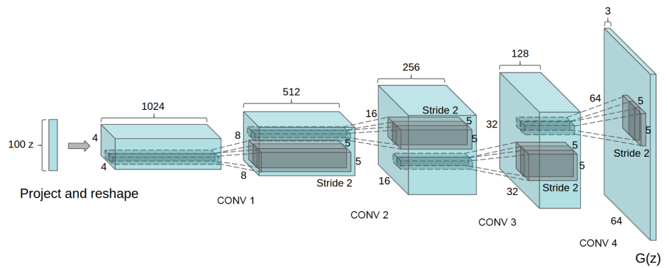

# tensorflow-dcgan
TensorFlow implementation of [Unsupervised Representation Learning with Deep Convolutional Generative Adversarial Networks, ICLR 2016](https://arxiv.org/abs/1511.06434)





## Installation

```
$ git clone https://github.com/kuc2477/tensorflow-dcgan && cd tensorflow-dcgan
$ pip install -r requirements.txt
```


## CLI

Implementation CLI is provided by `main.py`

#### Usage
```
$ ./main.py --help
$ usage: main.py [-h] [--dataset DATASET] [--resize [RESIZE]] [--noresize]
               [--crop [CROP]] [--nocrop] [--z_size Z_SIZE]
               [--g_filter_number G_FILTER_NUMBER]
               [--d_filter_number D_FILTER_NUMBER]
               [--g_filter_size G_FILTER_SIZE] [--d_filter_size D_FILTER_SIZE]
               [--learning_rate LEARNING_RATE] [--beta1 BETA1]
               [--epochs EPOCHS] [--batch_size BATCH_SIZE]
               [--sample_size SAMPLE_SIZE]
               [--loss_log_interval LOSS_LOG_INTERVAL]
               [--image_log_interval IMAGE_LOG_INTERVAL]
               [--checkpoint_interval CHECKPOINT_INTERVAL]
               [--discriminator_update_ratio DISCRIMINATOR_UPDATE_RATIO]
               [--test [TEST]] [--notest] [--resume [RESUME]] [--noresume]
               [--log_dir LOG_DIR] [--sample_dir SAMPLE_DIR]
               [--checkpoint_dir CHECKPOINT_DIR]

optional arguments:
  -h, --help            show this help message and exit
  --dataset DATASET     dataset to use dict_keys(['mnist', 'lsun', 'images'])
  --resize [RESIZE]     whether to resize images on the fly or not
  --noresize
  --crop [CROP]         whether to use crop for image resizing or not
  --nocrop
  --z_size Z_SIZE       size of latent code z [100]
  --g_filter_number G_FILTER_NUMBER
                        number of generator's filters at the last transposed
                        conv layer
  --d_filter_number D_FILTER_NUMBER
                        number of discriminator's filters at the first conv
                        layer
  --g_filter_size G_FILTER_SIZE
                        generator's filter size
  --d_filter_size D_FILTER_SIZE
                        discriminator's filter size
  --learning_rate LEARNING_RATE
                        learning rate for Adam [2e-05]
  --beta1 BETA1         momentum term of Adam [0.5]
  --epochs EPOCHS       epochs to train
  --batch_size BATCH_SIZE
                        training batch size
  --sample_size SAMPLE_SIZE
                        generator sample size
  --loss_log_interval LOSS_LOG_INTERVAL
                        number of batches per logging losses
  --image_log_interval IMAGE_LOG_INTERVAL
                        number of batches per logging sample images
  --checkpoint_interval CHECKPOINT_INTERVAL
                        number of batches per saving the model
  --discriminator_update_ratio DISCRIMINATOR_UPDATE_RATIO
                        number of updates for discriminator parameters per
                        generator updates
  --test [TEST]         flag defining whether it is in test mode
  --notest
  --resume [RESUME]     whether to resume training or not
  --noresume
  --log_dir LOG_DIR     directory of summary logs
  --sample_dir SAMPLE_DIR
                        directory of generated figures
  --checkpoint_dir CHECKPOINT_DIR
                        directory of trained models

```

#### Dataset
```
$ ./download.py mnist lsun
$ ./data.py export_lsun
```

#### Train
```
$ tensorboard --logdir=logs &
$ ./main.py --dataset=lsun [--resume]
```

#### Test
```
$ ./main.py --test
$ # checkout "./samples" directory.
```


## Reference
- [Unsupervised Representation Learning with Deep Convolutional Generative Adversarial Networks, ICLR 2016](https://arxiv.org/abs/1511.06434)


## Author
Ha Junsoo / [@kuc2477](https://github.com/kuc2477) / MIT License
